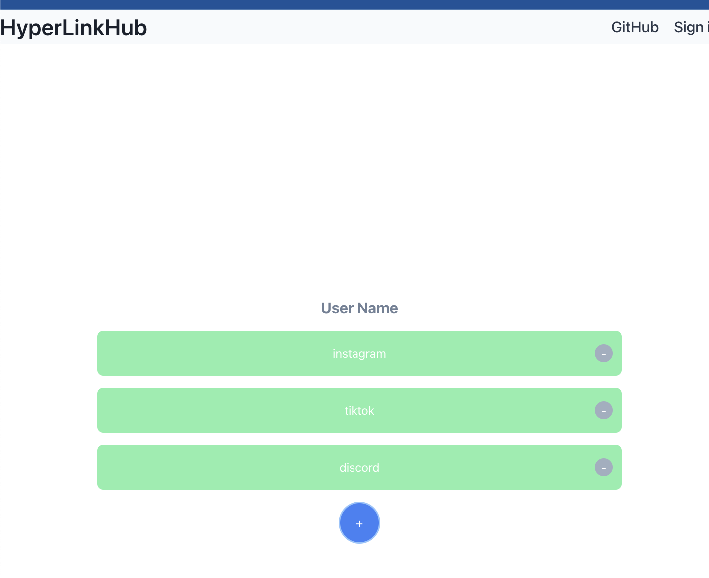

# HyperLink Hub

HyperLink Hub is a web application built with JavaScript, Express, Next.js, React, MongoDB, TypeScript, and Node.js, designed to create a link aggregation platform that prioritizes intuitive navigation and efficient link management for an improved user experience.


### Features

- Add a new link with a title and URL
- View all added links
- Delete a link
## Getting Started

### Prerequisites

- Node.js and npm
- MongoDB

### Installation

1. **Clone the repository:**
   ```bash
   git clone [repository URL]
   ```

2. **Install the dependencies:**
   ```bash
   npm install
   ```

3. **Create a .env file in the root directory of the project and add your MongoDB connection string:**
   ```plaintext
   MONGODB_URI=your_mongodb_connection_string
   ```

4. **Start the server:**
   ```bash
   npm run dev
   ```

The application will be available at `http://localhost:3000`.

## Usage

To add a new link, click the "+" button and enter the title and URL of the link. The new link will be added to the list.

To delete a link, click the "-" button next to the link you want to delete.

## Contributing

Contributions are welcome. Feel free to open an issue or submit a pull request.

## License

This project is licensed under the MIT License. See the LICENSE file for details.
